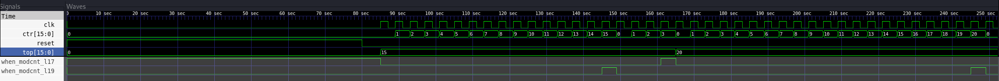

# Simple Modulo Counter

# Usage

1. Set the top-register with the modulo value

2. The counter will count up until the value is reached and then reset to '0'.

3. If the top-register is changed during runtime, the counter will restart from '0'.

# Install prerequisites:

``` sh
    sudo apt update
    sudo apt install sbt
    sudo apt install gtkwave
```

# Build

Build by using:

``` sh
    sbt "runMain ModcntrSim"
```

# Simulate with gtkwave by using:

``` sh
   gtkwave simWorkspace/Modcntr/test.vcd
```

# Waveform example:


