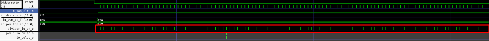
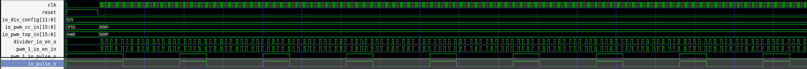

# PWM in style of RP2350 (simplified)


# Install prerequisites:

``` sh
    sudo apt update
    sudo apt install sbt
    sudo apt install gtkwave
```

# Build

Build by using:

``` sh
    sbt "runMain FullPwmSim"
```

# Simulate with gtkwave by using:

``` sh
   gtkwave simWorkspace/PwmSystem/test/wave.vcd
```

# Waveform example:

Small part of the simulation, for better viewing:



Full simulation screenshot:


